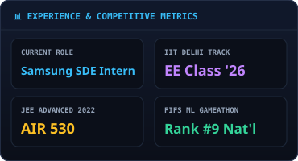

 

 

> **Electrical Engineering @ IIT Delhi ('26)** · **Software Engineering (SDE) × AI Systems × EDA Tooling**  
> I turn complex engineering bottlenecks into fast, reliable software. From building a **0.28s knowledge-graph code parser** to gesture-driven diffusion engines and high-concurrency quant backtesters, I ship systems that solve hard technical problems.

---

| 📊 System & Metric Benchmarks | 🛠 Core Tech Stack Distribution |
| :---: | :---: |
|  |  |

 

## 🛠️ What I Build & Solve

> 💡 **Active Engineering Mindset**: I love tackling high-impact algorithmic & architectural challenges — whether that's static analysis AST graph parsing, real-time computer vision HCI pipelines, or resilient LLM/RAG distributed backends.

<table>
  <tr>
    <td width="50%" valign="top">
      <h3><a href="https://github.com/goyal-harshit/codebase-intelligence-platform">Codebase Intelligence Engine</a> 🧠</h3>
      <code>Knowledge Graph</code> · <code>AST Parsing</code> · <code>Tree-sitter</code> · <code>NL→Cypher</code>
        
      Turns any Git repository into a knowledge graph and vector index. Enables natural language code queries (NL→Cypher with vector fallback), architecture risk detection, and blast-radius calculation. <b>Parsed Flask codebase in 0.28s</b> (388 functions, 53 classes).
        
      <b>Stack:</b> tree-sitter · ArcadeDB · ChromaDB · FastAPI · Next.js · Docker
        
      🔗 <a href="https://goyal-harshit.github.io/codebase-intelligence-platform">Live System Demo →</a>
    </td>
    <td width="50%" valign="top">
      <h3><a href="https://github.com/goyal-harshit/quant-analyzer">QuantAI Platform</a> ⚡</h3>
      <code>SDE</code> · <code>Quant Engine</code> · <code>Multi-LLM RAG</code> · <code>Distributed DBs</code>
        
      India-first equity quant research platform for NSE/BSE. Features factor screeners, backtesting algorithms, portfolio analysis, Monte Carlo simulation lab, and a multi-provider AI research assistant with fallback chains, JWT+CSRF auth, and Prometheus observability.
        
      <b>Stack:</b> FastAPI · Next.js 14 · PostgreSQL / TimescaleDB · Redis · Celery · Docker
        
      🔗 <a href="https://goyal-harshit.github.io/quant-analyzer">Live Platform Demo →</a>
    </td>
  </tr>
  <tr>
    <td width="50%" valign="top">
      <h3><a href="https://github.com/goyal-harshit/intuitive-prompt-engine">IntuitivePromptEngine</a> 🖐️</h3>
      <code>Computer Vision</code> · <code>Real-Time HCI</code> · <code>Scene Graph</code> · <code>WebSockets</code>
        
      Gesture-driven image generation engine. Translates real-time webcam gestures into semantic intent hypotheses, updates a persistent Scene Graph, and feeds diffusion prompts to generative models — zero prompt typing required.
        
      <b>Stack:</b> Python · MediaPipe · FastAPI · WebSocket · Ollama · FLUX / SDXL
        
      🔗 <a href="https://goyal-harshit.github.io/intuitive-prompt-engine">Live HCI Demo →</a>
    </td>
    <td width="50%" valign="top">
      <h3>Fantasy Cricket ML Engine 🏏</h3>
      <code>Ensemble ML</code> · <code>Optimization</code> · <code>Data Science</code>
        
      Ensemble ML system for player performance forecasting and optimal team selection under fantasy constraints. Competed nationally and achieved <b>Top 9 Rank</b> overall in FIFS Gameathon 2025.
        
      <b>Stack:</b> PyTorch · scikit-learn · Pandas · NumPy
        
      🏆 <b>Ranked #9 Nationally</b> (Google Cloud &amp; Dream11)
    </td>
  </tr>
</table>

---

## 💼 Work Experience

- 🏢 **Cadence Design Systems** — *Software & EDA Intern (2025)*  
  Engineered synthesis automation workflows, developed Python netlist analysis tools, and authored TCL scripts for software synthesis flow optimization.
- 🏢 **PwC India** — *Technology Consulting Intern (2024)*  
  Engineered digitized financial and workflow management systems serving a **130M+ farmer** user base.
- 🌍 **Cape Peninsula University of Technology, South Africa** — *AI Research Intern (2023–2024)*  
  Developed AI/ML models for smart microgrid load forecasting and grid stability optimization.

---

## 🛠 Skills & Technical Capabilities

| Domain | Technologies & Frameworks |
|---|---|
| **Software Engineering (SDE)** | Python, C++, TypeScript, SQL, TCL, Verilog, Data Structures & Algorithms, System Design |
| **AI / ML & LLMs** | PyTorch, TensorFlow, scikit-learn, RAG (Retrieval-Augmented Generation), Vector DBs (ChromaDB), Knowledge Graphs (ArcadeDB, Cypher), Ollama, MediaPipe |
| **Backend & Infrastructure** | FastAPI, Next.js 14, PostgreSQL, TimescaleDB, Redis, Celery, Docker, GitHub Actions, Linux, REST APIs, WebSockets |
| **EDA & Semiconductor** | Logic Synthesis Automation, STA, RTL Design, Cadence Genus & Innovus, Netlist Analysis Tools |

---

## 🏆 Honors & Key Achievements

- 🥇 **JEE Advanced 2022 — AIR 530** (GE) among 250,000+ candidates.
- 🎯 **JEE Main 2022 — 99.74 Percentile** among 1,000,000+ candidates.
- 🥉 **FIFS ML Gameathon 2025 — 9th Rank Nationally** (Google Cloud &amp; Dream11).

---

<b>📂 Repository Index & Active Projects (Expand)</b>

 

- [**Codebase Intelligence Platform**](https://github.com/goyal-harshit/codebase-intelligence-platform) — Code graph analysis and retrieval system.
- [**QuantAI**](https://github.com/goyal-harshit/quant-analyzer) — Quantitative finance research & backtesting platform.
- [**IntuitivePromptEngine**](https://github.com/goyal-harshit/intuitive-prompt-engine) — Gesture-controlled prompt synthesis.
- [**Portfolio Site**](https://github.com/goyal-harshit/goyal-harshit.github.io) — Next.js SDE/AI + VLSI showcase site.

---

  ⚡ Self-drawing profile README system · Dynamically updated via GitHub Actions

