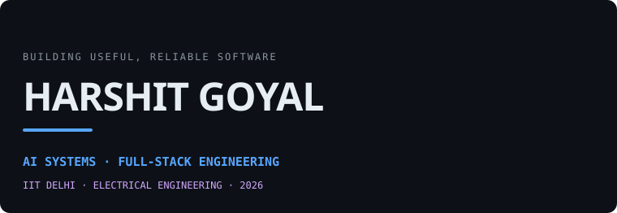
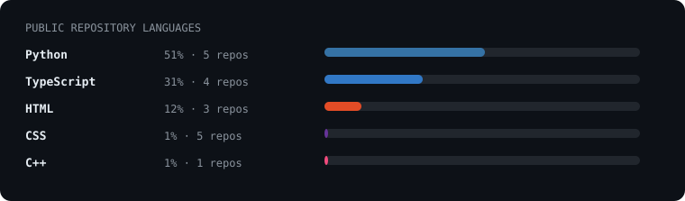

> Electrical Engineering at IIT Delhi · AI systems and full-stack engineering.
> I build reliable products where models, data infrastructure, and engineering constraints meet.

  <a href="https://goyal-harshit.github.io">portfolio</a> ·
  <a href="https://www.linkedin.com/in/goyal-harshit-iitd/">linkedin</a> ·
  <a href="mailto:harshitgoyal780p@gmail.com">email</a> ·
  <a href="https://goyal-harshit.github.io/resume/Harshit_Goyal_Software_AI.pdf">software/AI resume</a> ·
  <a href="https://goyal-harshit.github.io/resume/Harshit_Goyal_VLSI.pdf">VLSI resume</a>

 

 

## selected_builds

<table>
  <tr>
    <td width="50%">
      <h3><a href="https://github.com/goyal-harshit/quant-analyzer">QuantAI</a></h3>
      <samp>quant research · reliability engineering · RAG</samp>
        
      India-first research platform for NSE/BSE equities: factor screening, backtesting, portfolio tracking, Monte Carlo analysis, and a multi-provider research assistant. Designed with fallback chains, circuit breakers, and DB-first serving so the demo remains useful when upstream services fail.
        
      <a href="https://goyal-harshit.github.io/quant-analyzer">live demo →</a>
    </td>
    <td width="50%">
      <h3><a href="https://github.com/goyal-harshit/codebase-intelligence-platform">Codebase Intelligence</a></h3>
      <samp>knowledge graph · static analysis · developer tools</samp>
        
      Turns a Git repository into a knowledge graph and vector index for plain-English code Q&amp;A, architecture-risk detection, and change-impact analysis. The parser processed a Flask codebase in 0.28 s: 388 functions and 53 classes.
        
      <a href="https://goyal-harshit.github.io/codebase-intelligence-platform">live demo →</a>
    </td>
  </tr>
  <tr>
    <td width="50%">
      <h3><a href="https://github.com/goyal-harshit/intuitive-prompt-engine">IntuitivePromptEngine</a></h3>
      <samp>computer vision · HCI · generative AI</samp>
        
      Gesture-driven image generation: webcam signals become semantic intent, a persistent scene graph, and diffusion prompts. The pipeline is interface-driven and swappable—no typing required.
        
      <a href="https://goyal-harshit.github.io/intuitive-prompt-engine">live demo →</a>
    </td>
    <td width="50%">
      <h3>EDA / VLSI tooling</h3>
      <samp>RTL · synthesis · STA · automation</samp>
        
      At Cadence, I worked across the RTL-to-Pre-CTS flow with Genus and Innovus, plus Python netlist analysis and TCL flow automation. I’m interested in the software systems that make silicon implementation more reliable.
        
      <a href="https://goyal-harshit.github.io/vlsi/">VLSI portfolio →</a>
    </td>
  </tr>
</table>

## now

- Building production-grade AI and data systems; exploring the overlap of developer tools, retrieval, and trustworthy automation.
- Pursuing Electrical Engineering at IIT Delhi (Class of 2026), with a second engineering track in digital design and EDA.
- Selected results: JEE Advanced AIR 530 · FIFS ML Gameathon 2025, 9th nationally.

<samp>repository index / expand</samp>

 

**Active systems**

- [Codebase Intelligence Platform](https://github.com/goyal-harshit/codebase-intelligence-platform) — knowledge graph, retrieval, static analysis, and developer workflow tooling.
- [QuantAI](https://github.com/goyal-harshit/quant-analyzer) — quantitative research and portfolio-analysis platform for Indian markets.
- [IntuitivePromptEngine](https://github.com/goyal-harshit/intuitive-prompt-engine) — gesture-first generative image interface.
- [Portfolio](https://github.com/goyal-harshit/goyal-harshit.github.io) — this public-facing Software/AI + VLSI portfolio.

**Archived learning work**

- [Co-operative Technology prototype](https://github.com/goyal-harshit/Co-operative-technology-website-prototype)
- [C++ projects](https://github.com/goyal-harshit/cpp_projects)
- [HTML projects](https://github.com/goyal-harshit/html-projects)
- [Java projects](https://github.com/goyal-harshit/java_projects)
- [Python projects](https://github.com/goyal-harshit/python-projects)

<samp>stack / expand</samp>

 

- **Languages:** Python, C++, TypeScript, SQL, TCL, Verilog, MATLAB
- **AI / data:** PyTorch, TensorFlow, scikit-learn, RAG, LLM APIs, Ollama, MediaPipe
- **Systems:** FastAPI, Next.js, PostgreSQL, Redis, Docker, GitHub Actions, Linux
- **Semiconductor:** RTL, logic synthesis, STA, Cadence Genus &amp; Innovus

---

<samp>this profile is drawn by its own repository · public data only · refreshes daily</samp>

